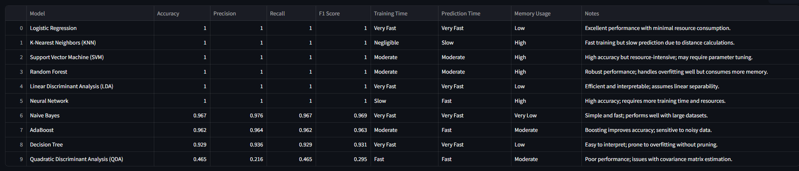

  

# 🔍 Hybrid Log Classification System

  

In this project, we developed a comprehensive log classification system that synergizes multiple machine learning approaches to effectively handle diverse and complex log data. By integrating rule-based methods with data-driven models, our system adeptly processes structured, semi-structured, and unstructured logs. This hybrid approach ensures robust performance across varying data complexities, enhancing error detection and system monitoring capabilities.

  

---

  

## Project Demo

Expect some delay in loading the app is it is deployed on free cloud and probably is in  `Sleep Mode`
[](https://romin-log-lens.streamlit.app)

  
  

---

  

## 🧪 1. Generating Synthetic Data

  

To simulate real-world scenarios without compromising privacy, we utilized synthetic data generation techniques. Tools like `ydata-synthetic` offer robust solutions for creating realistic synthetic datasets, facilitating experimentation and model development without the need for sensitive information.

  

---

  

## 🧹 2. Data Cleaning and Exploratory Data Analysis (EDA)

  

Before diving into modeling, we performed thorough data cleaning and EDA to understand the dataset's structure and nuances.

  

*  **Handling Missing Values**: Identified and addressed any missing entries to ensure data integrity.

  

*  **Encoding Categorical Variables**: Transformed categorical features into numerical representations suitable for machine learning algorithms.

  

*  **Feature Scaling**: Applied `StandardScaler` or `MinMaxScaler` where appropriate, particularly for algorithms sensitive to feature scales.

  

*  **Visualization**: Utilized histograms, box plots, and correlation matrices to uncover patterns and relationships within the data.

  

---

  

## 🤖 3. Model Training and Data Preparation

  
### 📋 Overview

  

The goal is to classify system log messages into one of the following categories:

- `HTTP Status`

- `Security Alert`

- `System Notification`

- `Error`

- `Resource Usage`

- `Critical Error`

  

Log messages are highly imbalanced in distribution, which was the key challenge addressed during model development.

  

---

  

## 🧹 Step 1: Data Preprocessing

  

### 1.1. Sentence Embedding

  

Log messages (free-text) were transformed into fixed-length numerical vectors using:

  

```python

from sentence_transformers import SentenceTransformer

model_embedding = SentenceTransformer('all-MiniLM-L6-v2')
X = model_embedding.encode(df['log_message'].tolist())
```

  

This model converts each log message into a dense 384-dimensional embedding, capturing semantic meaning suitable for downstream classification.

  

### 1.2. Label Encoding

  

Target labels were converted into a numpy array for modeling:

  

```python
y = df['target_label'].values
```

  

---

  

## ⚖️ Step 2: Handling Class Imbalance

  

Class imbalance was significant, with some classes having <200 examples and others over 1000. To handle this:

  

### ✅ Option 1: **SMOTE + Custom Sampling**

  

```python

from imblearn.over_sampling import SMOTE

smote = SMOTE(sampling_strategy={
'Critical Error': 400,
'Resource Usage': 400,
'Error': 400,
'System Notification': 400,
'Security Alert': 400
}, random_state=42)

X_resampled, y_resampled = smote.fit_resample(X, y)

```

  

We explicitly avoided oversampling the majority class (`HTTP Status` with 1017 samples), keeping it unchanged to avoid excessive duplication. This approach ensures class distribution is more uniform without artificially bloating the dataset.

  

### ✅ Option 2: **Balanced Random Forest (Built-in Resampling)**

  

```python
from imblearn.ensemble import BalancedRandomForestClassifier
```

  

This classifier automatically balances classes by undersampling the majority class in each bootstrap sample **per tree**, eliminating the need for explicit resampling. It's highly effective for imbalanced datasets.

  

---

  

## ⚙️ Step 3: Feature Scaling

  

Even though tree-based models don’t require scaling, we used `StandardScaler` to normalize features (embeddings) to zero mean and unit variance, especially for models sensitive to feature scale:

  

```python
from sklearn.preprocessing import StandardScaler
scaler = StandardScaler()
X_train_scaled = scaler.fit_transform(X_train)
X_test_scaled = scaler.transform(X_test)

```

  

---

  

## 🏋️ Step 4: Model Training

  

### 🔹 Logistic Regression (Baseline)

  

```python
from sklearn.linear_model import LogisticRegression

clf = LogisticRegression(max_iter=1000, class_weight='balanced', random_state=42)
clf.fit(X_train_scaled, y_train)
```

  

### 🔹 K-Nearest Neighbors (KNN)

  

```python
from sklearn.neighbors import KNeighborsClassifier

clf = KNeighborsClassifier(n_neighbors=5)
clf.fit(X_train_scaled, y_train)
```

  

### 🔹 Balanced Random Forest (Preferred for Imbalance)

  

```python
from imblearn.ensemble import BalancedRandomForestClassifier

clf = BalancedRandomForestClassifier(n_estimators=100, random_state=42)
clf.fit(X_train_scaled, y_train)
```

  

---

  

## 🧪 Step 5: Evaluation

  

```python
from sklearn.metrics import classification_report, confusion_matrix, ConfusionMatrixDisplay

y_pred = clf.predict(X_test_scaled)
print(classification_report(y_test, y_pred))
cm = confusion_matrix(y_test, y_pred, normalize='true')
ConfusionMatrixDisplay(confusion_matrix=cm, display_labels=clf.classes_).plot()
```

  

---

  

## 💾 Step 6: Saving Models & Scalers

  

```python
import joblib

joblib.dump(clf, 'models/balanced_rf.joblib')
joblib.dump(scaler, 'models/scaler.joblib')
```

  

---

  

## ✅ Summary

  
| Component  | Technique  |
|--|--|
| Text Embedding | Sentence-BERT (`all-MiniLM-L6-v2`) |
| Imbalance Handling | SMOTE (explicit) or Balanced RF (inherent) |
| Feature Scaling | StandardScaler |
| Models Trained | Logistic Regression, KNN, Balanced Random Forest |
| Evaluation | F1-score, confusion matrix |


  

This approach ensures robust classification while mitigating class imbalance, improving generalization across all log categories.

  

### Findings:

  



  

**Recommendation**: Considering both performance and computational efficiency, **Logistic Regression** emerged as the optimal choice, delivering perfect accuracy with minimal resource consumption.

  

---

  

## 🌐 4. Deploying the Model with Streamlit

  

To make our model accessible and interactive, we developed a web application using Streamlit.

  

### Key Features:

  

*  **User-Friendly Interface**: Intuitive design allowing users to navigate and utilize the app effortlessly.

  

*  **Model Selection**: Users can choose from the trained models to make predictions.

  

*  **Data Upload**: Option to upload CSV files for batch predictions.

  

*  **Real-Time Predictions**: Immediate output of predictions upon data input.

  

*  **Downloadable Results**: Ability to download prediction results as a CSV file.

  

### How It Works:

  

1.  **Upload Data**: Users upload their dataset in CSV format.

  

2.  **Select Model**: Choose the preferred machine learning model from the available options.

  

3.  **Make Predictions**: The app processes the data and outputs predictions.

  

4.  **Download Results**: Users can download the predictions for further analysis or reporting.

  

---

  

## 🔮 5. Future Enhancements

  

To further improve the application, we plan to implement the following features:

  

*  **Model Explanation**: Integrate tools like SHAP or LIME to provide insights into model predictions.

  

*  **Model Retraining**: Allow users to retrain models with their own data directly through the app.

  

*  **Enhanced Visualizations**: Incorporate advanced charts and graphs for better data interpretation.

  

---

  

By following this end-to-end approach, we've created a robust and user-friendly machine learning application that streamlines the process from data ingestion to prediction deployment. Whether you're a data enthusiast or a seasoned professional, this project serves as a valuable blueprint for developing and deploying machine learning solutions.

  

Feel free to customize and expand upon this framework to suit your specific needs and objectives!